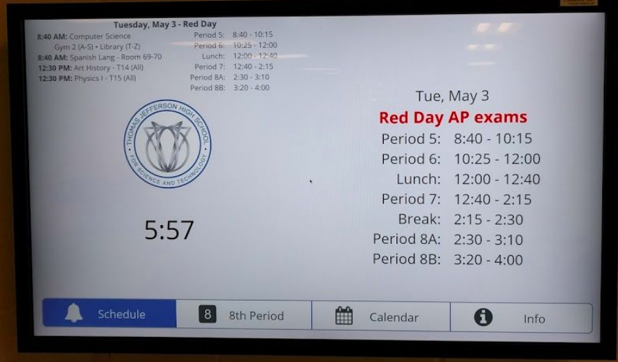

# Signage

**Signage** refers to the set of eleven electronic displays located all over the school. A "Signage" refers to a display that displays useful information maintained by the CSL across the school.

Currently, each Signage display shows the:

* Schedule
* Map of school
* Announcements
* Bus map

The Signage displays also can show special event information.

The latest version of Signage is **Signage3**.

The core of Signage runs on Intel Compute Sticks \([official website](https://www.intel.com/content/www/us/en/products/boards-kits/compute-stick.html)\).  

## History

### Signage1

The first Signage displays were installed around the first release of Ion \([source](https://tjhsst.edu/~jwoglom/ion.pdf)\) \(around May 2016\).  They were originally developed as a complement to Ion.  These efforts were led by James Woglom.  The Signage displays ran on a mixture of Raspberry Pi 1s, Raspberry Pi 2s, and Raspberry Pi 3s.

### Signage2

Development of Signage2 began in April of 2017 to serve as a rewrite of Signage1 using Python's Kivy framework.  Various limitations imposed by the Kivy app and slow performance led to the end of development around March of 2018.  

_Image omitted because Kivy is bad_

### Signage 3

Development of Signage3 began in March of 2018 to serve as a rewrite of Signage3 as a webpage hosted on Ion.  Signage3 was deployed on newly-arrived Intel Compute Sticks on April 12, 2018.  Signage3 remains the current Signage deployed throughout the school.

## List

The current deployed Signage displays are named:

* cs-nobel
* cs-curie
* cs-galileo
* cs-cafeteria
* cs-gandhi-a
* cs-audlob
* cs-library 
* cs-hopper
* cs-cafe
* cs-einstein-a

## Current Setup

Each Signage display has their own Intel Compute Stick which runs Ubuntu Server 16.04 LTS.  Using getty, each Signage display logs in as user and opens up a specific web page on Ion \(`https://ion.tjhsst.edu/signage/display/<display_name>`\) in Chromium.  The Signage pages use iframes in order to display content.  The code for Signage can be found [here](https://github.com/tjcsl/ion/tree/master/intranet/apps/signage). 

