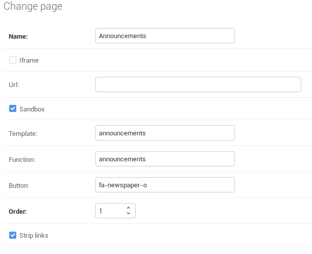
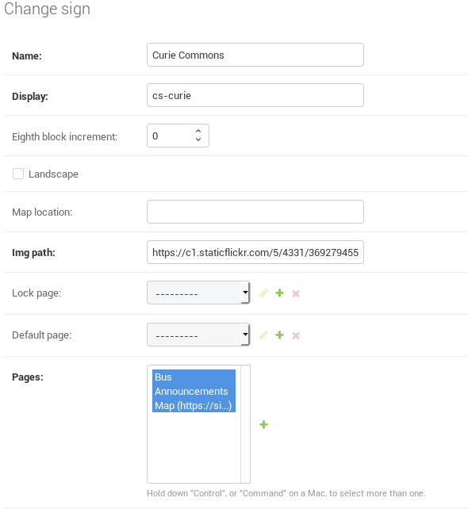

# Administration

## Sign/Page Administration

### Develop New Page

Views for each Signage page are located in the [pages.py code](https://github.com/tjcsl/ion/blob/master/intranet/apps/signage/pages.py).  To add a new page, define the context in`pages.py`.   The template should be defined in `templates/signage/pages/<page_name>.html`.  

### Create New Page

Each Signage display renders multiple pages.  Each page is defined within a `Page` model.  Within Django admin, define the:

* name: Some descriptive name to represent the Page
* template: The location of the template \(`templates/signage/pages/<template>.html`\)
* function: The function defined in `pages.py` for server-side rendering of context \(e.g. `hello_world`\)
* button: The name of font-awesome icon to be used on the navigation bar \(e.g. `fa-bus`\)

The other fields can be left at their defaults.

Example:

The example Page shown above is named `Announcements`.  

* Since we want the page to be rendered server-side \(not as an iframe\), the `iframe` box is not checked. 
* Since the page is not an iframe, we leave the `url`field as is.  
* Since this not an iframe, we can leave the `sandbox` checkbox as is \(for more information about this option read [https://developer.mozilla.org/en-US/docs/Web/HTML/Element/iframe\#attr-sandbox](https://developer.mozilla.org/en-US/docs/Web/HTML/Element/iframe#attr-sandbox)\).  
* The `template` field is set to `announcements`, meaning that Ion will try to render `templates/signage/pages/announcements.html`.  
* The f`unction` field is set to `announcements`, meaning that Ion will use the `announcements` function in `pages.py` as context.  
* The `button` field is set to `fa-newspaper-o`, meaning that this Font Awesome icon will be used in the navigation bar.  
* The `order` field is set to 1, meaning that the button is second on the navigation bar.  The pages should be ordered sequentially.
* The `strip_links` field is checked off because you should not be able to navigate off a page by clicking a link.  If this functionality is not desired, uncheck the box.

### Create New Sign

Each Sign is defined within a `Sign` model.  Within Django admin, define the:

* name: Some friendly display name \(required\)
  * This is displayed on the main schedule page \(e.g. Curie Commons\)
* display: A unique name \(the Stick's hostname\) \(required\) \(e.g. cs-curie\)
* landscape: True if display is landscape and False if display is not landscape
* map\_location:
* img\_path: A URL to an image to display on the main schedule page.  Leave at default for the default TJ image
* lock\_page:
* display\_page:
* pages:

Example:

The example Sign 

### Special Events

Signage is often used to display pages for special events that occur at TJ.  Generally, these are just iframes to some 

## Display Administration

### Rebooting

Often it is necessary to reboot Signage displays.  To perform a reboot manually, run  `sudo shutdown -r now` or  `sudo reboot`  within the Signage's terminal. To reboot the entire deployment, run `ansible  -i hosts -a "shutdown -r now" -u user -K signage`. 

### Connecting

To SSH to the Signage displays, a CSL VPN is necessary.  Ask a VPN admin to set up a certificate for you. 

